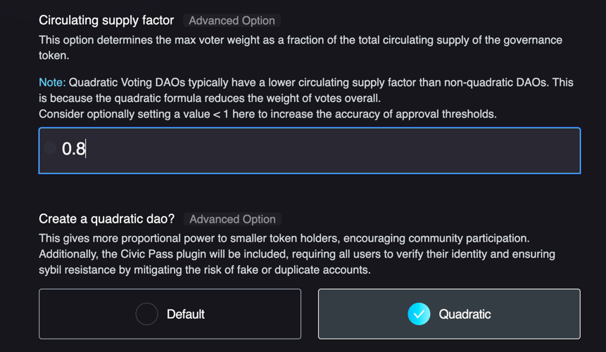

# 🟨 Quadratic Voting

## What is Quadratic Voting?

Quadratic Voting (QV) is a voting mechanism that ascribes a "cost" to a vote, allowing:
- voters to express the intensity of their preferences across a range of issues
- the tempering of the influence of wealthy voters, by increasing the cost of additional votes

The Quadratic Voting Plugin in Realms implements the latter feature by making the voting power of a
member proportional to the square root of the number of tokens they hold. 

This has the effect of increasing the voting power of minority voters compared to large token holders,
increasing alignment and encouraging voter participation.

## What is Sybil Resistance?

One challenge to Quadratic Voting is the potential for a single voter to create multiple accounts, split their
tokens between them, and vote multiple times.

This is known as a **Sybil Attack**.

To mitigate this in Realms, the [Civic Pass Plugin](civic.md) is also used, to ensure that each voter is a unique individual.

This means that Quadratic Voting DAOs in Realms require voters to have a Civic Pass. For more details, see [civic.com](https://civic.com).

## How to use Quadratic Voting in Realms?

### Voting in a Quadratic Voting DAO

As a voter, once you have obtained your Civic Pass (see above), 

### Creating a QV DAO from Scratch

##### Step 1 - Select Community DAO

Choose the **Community Token DAO** option from the **Create DAO** page.

##### Step 2 - Select Quadratic

In the **Community Token** section, select **Advanced Options**,
and then select **Quadratic**.

Note: It is possible here to configure the Quadratic Voting plugin. We recommend keeping the default settings.
To learn about the configuration options, see below.

##### Step 3 - Create DAO

Proceed through the other steps of the DAO and create it.

### Adapting an existing DAO to use QV

:::danger
The **spl-governance** program version must be equal or higher than **v2.2.6** for the **QV** plugin to work correctly.

If the plugin is enabled for **older versions** it can result in **irreversible deadlock** of the **DAO**.
:::

#### Step 1 - Add Civic Pass Plugin

Select the **Params** button and choose **Change config**.

Select **Civic** as the governance structure

Leave the pass type as the default.

Click **Continue**, **Create Proposal** and vote on the resultant proposal.

Once the proposal has passed, execute it.

#### Step 2 - Add QV Plugin

Once again, select the **Params** button and choose **Change config**.

This time, select **Quadratic** as the governance structure, and enable the
**Chain this plugin with the Civic Plugin?** option.

Leave the coefficients as the default.

Click **Continue**, **Create Proposal** and vote on the resultant proposal.

Once the proposal has passed, execute it.

You have now converted the DAO to use Quadratic Voting!

## Advanced Configuration

### Coefficients

The QV plugin uses the following formula for calculating the voting power of a member:

$$
a\sqrt{x}+bx+c
$$

The coefficients `a`, `b`, and `c` can be configured by the DAO creator, but are set as default to 1,0,0 respectively(*),
which has the effect of making the voting power of a member equal to the square root of the number of tokens they hold.

'* The `a` coefficient in fact depends on the number of decimal places of the token, and is formally calculated as $\sqrt{10^tokenDecimals}$

Setting the coefficients to different values can have the effect of making the voting power of a member more or less sensitive to the number of tokens they hold.
For extreme examples:

- Setting `a` and `c` to 0 and `b` to 1 would make the voting power of a member equal to the number of tokens they hold.
- Setting `a` and `b` to 0 and `c` to 1 would make the voting power of a member equal to 1,
regardless of the number of tokens they hold, resulting in a one-person one-vote system.

### Civic Pass

The choice of Civic Pass type can be configured by the DAO creator, and can be set to any of the available Civic Pass types.
However, it is worth noting that not all Civic Passes are suitable for sybil resistance. Therefore it is recommended to 
use the default Civic Pass type to secure your DAO.

### Circulating Token Supply Factor

When configuring your DAO, you have the option to set the circulating token supply to a percentage of the total
token supply.

This allows a DAO to configure its maximum voter weight, which, in a quadratic voting DAO, is based on the
token distribution and is typically less than the total token supply.

This is particularly useful if you know the upper limit will not exceed a fixed value.

For example, if 25% of the total supply is held by a single entity, that votes in a block, then
you can set the circulating supply factor to 75% + the square root of the number of tokens held by the entity.

### Approval Quorum

The approval quorum is the amount of votes required for a proposal to pass. It is set as a percentage of the circulating
voter weight. Combined with the circulating total supply factor, this allows a DAO to configure the amount of votes
needed for a proposal to pass, and adapt it over time.

This value should be used when the max voter weight is not known, or varies frequently.

:::tip
In need of **help**? Hop on on [**Realms Discord**](https://discord.com/invite/VsPbrK2hJk) and ask away your questions!
:::